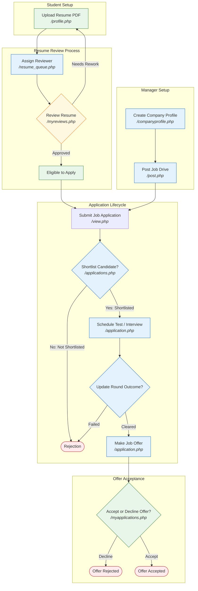

# Job Portal User Guide (`local_jobportal`)

This guide provides step-by-step instructions, exact URLs, navigation paths, and user roles for all sections of the Moodle Job Portal.

---

## Recruitment Workflow Flowchart

Below is a visual diagram showing how Managers, Students, and Reviewers interact in the Job Portal system. You can open the vector image directly at [workflow_chart.svg](file:///c:/Users/Admin/Desktop/Job%20Portal/moodle-local-jobportal/workflow_chart.svg) or view the embedded flowchart:

### Mermaid Text-Based Chart Source
Below is the text representation of the flowchart:

---

## Access & Roles Overview

All Job Portal pages are relative to your Moodle site base URL (e.g. `http://localhost/moodle` or `https://moodle.example.com`).

*   **Student Interface:** Focused on resume uploads, job browsing, applying, and tracking application stages.
*   **Manager Interface:** Focused on company profile creation, job posting, assigning resume reviewers, shortlisting, scheduling interviews/tests, and dashboards.
*   **Reviewer Interface:** Focused on evaluating student resumes assigned to them.

---

## 1. Company Profile Setup (Managers)

Before posting any jobs, a manager must register a company profile.

*   **Target User:** Managers (`local/jobportal:managecompanyprofile`)
*   **Exact URL:** `/local/jobportal/companyprofile.php`
*   **How to Navigate:** Go to the Job Portal homepage, find **Quick Navigation** in the sidebar, and click **Company Profile** (or **Manage Companies**).
*   **Step-by-Step Instructions:**
    1.  Go to `/local/jobportal/companyprofile.php`.
    2.  Click the **"Add Company Profile"** button.
    3.  Enter the **Company Name** (e.g. "Bosch Global Software Technologies").
    4.  Fill in the **Description** and **Website URL**.
    5.  Upload a logo file under **Company Logo** (drag and drop or file picker).
    6.  Click **"Save changes"**.

---

## 2. Resume Submission (Students)

Students must upload a resume before they can apply for jobs (depending on the site's Job Access Policy).

*   **Target User:** Students (`local/jobportal:apply`)
*   **Exact URL:** `/local/jobportal/profile.php`
*   **How to Navigate:** On the Job Portal homepage, click **"My Profile"** in the navigation menu.
*   **Step-by-Step Instructions:**
    1.  Go to `/local/jobportal/profile.php`.
    2.  Fill in your skills keywords (e.g. `C, Firmware, RTOS`), experience details, and educational background.
    3.  Under the **Resume** section, upload your resume PDF (max size: 5MB).
    4.  Click **"Save changes"**.
    5.  Your resume review status will change to **Submitted**.

---

## 3. Resume Review Assignment (Managers)

Managers assign submitted student resumes to specific reviewers (teachers or other managers).

*   **Target User:** Managers (`local/jobportal:assignresumereviewers`)
*   **Exact URL:** `/local/jobportal/resume_queue.php`
*   **How to Navigate:** Go to the homepage sidebar, click **"Resume Queue"**.
*   **Step-by-Step Instructions:**
    1.  Go to `/local/jobportal/resume_queue.php`.
    2.  You will see a list of student profiles. Locate those with status `Submitted` or `Needs Review`.
    3.  Select the checkbox next to the student's name.
    4.  Scroll to the bottom, select a reviewer from the dropdown menu, and click **"Assign Reviewer"**.

---

## 4. Resume Evaluation (Reviewers)

Reviewers evaluate resumes assigned to them and give feedback.

*   **Target User:** Reviewers/Teachers/Managers (`local/jobportal:reviewresumes`)
*   **Exact URL:** `/local/jobportal/myreviews.php` (Reviewer Inbox) or `/local/jobportal/resume_review.php` (General Reviewer Panel)
*   **How to Navigate:** Click **"My Resume Reviews"** in the sidebar.
*   **Step-by-Step Instructions:**
    1.  Go to `/local/jobportal/myreviews.php`.
    2.  Click **"Open Review"** next to the assigned student.
    3.  Use the preview panel to view the resume file directly.
    4.  Select a rating from **1 Star** to **5 Stars**.
    5.  Write constructuve review feedback.
    6.  Set the decision:
        *   **Approve:** Changes status to `Approved`. The student can now apply to jobs.
        *   **Needs Rework:** Changes status to `Needs Rework`. The student is notified to re-upload.
    7.  Click **"Submit Review"**.

---

## 5. Job Posting (Managers)

Create job advertisements with specific salary structures.

*   **Target User:** Managers (`local/jobportal:postjobs`)
*   **Exact URL:** `/local/jobportal/post.php`
*   **How to Navigate:** On the main index page, click **"Post a Job"**.
*   **Step-by-Step Instructions:**
    1.  Go to `/local/jobportal/post.php`.
    2.  Select the **Company** from the dropdown menu.
    3.  Enter **Job Title**, **Location**, and **Job Type** (Full-time, Part-time, Internship, etc.).
    4.  Choose the **Salary Model**:
        *   `Fixed`: Enter a single amount.
        *   `Range`: Enter minimum and maximum amounts.
        *   `Progressive`: Set stage-based rows (e.g. Training: 30K/month, Confirm: 6LPA/annual).
        *   `Undisclosed` or `Custom`: Standard text info.
    5.  Set the application **Deadline** and requirements checklist.
    6.  Ensure **Status** is checked as **Active** so students can see it.
    7.  Click **"Save changes"**.

---

## 6. Job Search & Apply (Students)

Eligible students can browse opportunities and apply.

*   **Target User:** Students (`local/jobportal:viewjobs` and `local/jobportal:apply`)
*   **Exact URL:** `/local/jobportal/index.php` (Main job search feed)
*   **Step-by-Step Instructions:**
    1.  Go to `/local/jobportal/index.php`.
    2.  Search or filter listings by location, type, or salary.
    3.  Click on a job title to open its detail page (`/local/jobportal/view.php?id=<jobid>`).
    4.  Click the **"Apply Now"** button.
    5.  Review your profile resume preview, type a **Cover Letter**, and click **"Submit Application"**.

---

## 7. Shortlisting Applicants (Managers)

Review submissions and move candidates forward.

*   **Target User:** Managers (`local/jobportal:viewapplications`)
*   **Exact URL:** `/local/jobportal/applications.php?id=<jobid>`
*   **How to Navigate:** Open any job posting page and click **"View Applications"**.
*   **Step-by-Step Instructions:**
    1.  Go to the application list for a job drive.
    2.  Inspect candidates, cover letters, and resume files.
    3.  To update candidates in bulk:
        *   Select the checkboxes next to their names.
        *   Choose a status from the bulk action selector at the bottom (e.g. **Shortlist** or **Mark Not Shortlisted**).
        *   Click **"Apply Update"**.

---

## 8. Schedulable Selection Rounds (Managers)

For shortlisted students, manage their tests and interviews.

*   **Target User:** Managers (`local/jobportal:managejobs`)
*   **Exact URL:** `/local/jobportal/application.php?id=<applicationid>` (Single application details)
*   **How to Navigate:** In the applicant table (`applications.php`), click **"Open Application"** next to a student.
*   **Step-by-Step Instructions:**
    1.  Go to the single application page.
    2.  Find the **Recruitment Checklist / Selection Rounds** card.
    3.  Click **"Create Round"**:
        *   Select type: **Test** or **Interview**.
        *   Set the **Scheduled Date & Time**.
        *   Choose **Mode**: `online` (enter link) or `offline` (enter venue details).
        *   Save the round.
    4.  Once the round is completed:
        *   Click **"Edit"** on that round.
        *   Change status to `Completed`, `No Show`, or `Excused`.
        *   If completed, set the outcome: `Cleared` (moves them forward) or `Not Cleared`.

---

## 9. Offers & Selection (Managers & Students)

The final stage of the recruitment process.

*   **Manager Actions:**
    1.  On the application detail page, select **"Make Offer"** to set the stage to `offermade`.
    2.  An automatic template notification is sent to the student.
*   **Student Actions:**
    1.  Go to `/local/jobportal/myapplications.php` (Student Dashboard).
    2.  Locate the job posting showing **"Offer Made"** banner.
    3.  Click **"Accept Offer"** or **"Decline Offer"** to finalize the drive.

---

## 10. Analytics Dashboards (Managers)

Track recruitment performance metrics.

*   **Funnel Dashboard:** `/local/jobportal/dashboard.php`
    *   *What it shows:* Stage conversion rates (Applied -> Shortlisted -> Interviewed -> Offer), company-wise applications volume, and placement percentages.
*   **Job Post Dashboard:** `/local/jobportal/jobsdashboard.php`
    *   *What it shows:* Average days a job drive stays open, stale job drives (no activity in X days), and overall job status counts.
